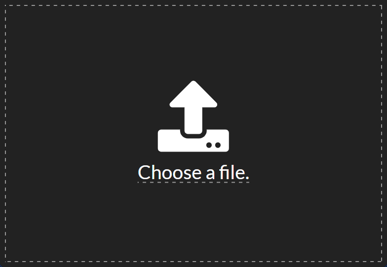
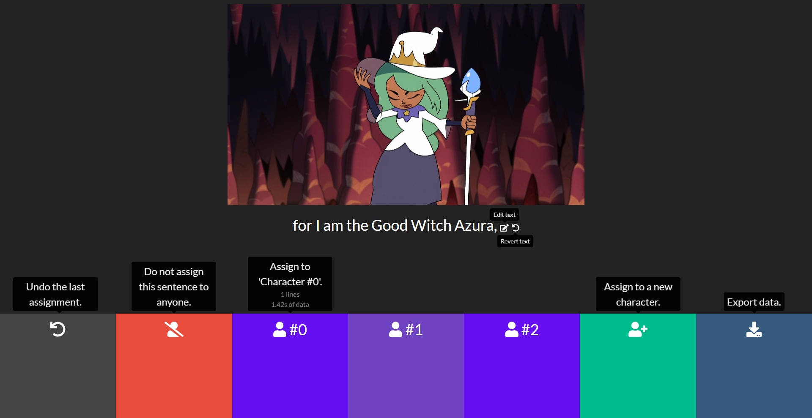

# aidatasetfromvideo

A utility to sort and slice a captioned video into a dataset for [tacotron](https://github.com/keithito/tacotron)

[](https://github.com/HexCodeFFF/aidatasetfromvideo/releases)


[](https://github.com/HexCodeFFF/aidatasetfromvideo/stargazers)


## premise

Creating a dataset for an AI voice is typically tedious work. Audio needs to be manually sliced and transcribed. This is
compounded by the fact that typically 30 minutes or more of voice data is needed.

This project takes advantage of the work of captioners. Essentially all content that is aired on television has already
been captioned. Caption data is already pre-sliced and transcribed, however, it isn't often perfect as-is for AI. This
project plays videos caption-by-caption to allow the user to discard lines that aren't good and to sort lines by _who_
is saying them.

## usage

### installation

Download the latest installer from [the releases page](https://github.com/HexCodeFFF/aidatasetfromvideo/releases). The
installer should install the program, add a desktop icon, and then launch it. No input required.

### choose a file



The app presents you with a "Choose a file" screen. The file _must_ have video, audio, and subtitles.

To add subtitles to an MKV file:

```shell
ffmpeg -i infile.mkv -i infile.srt -c copy outfile.mkv
```

To add subtitles to an MP4 file:

```shell
ffmpeg -i infile.mp4 -i infile.srt -c copy -c:s mov_text outfile.mp4
```

MP4 files are less flexible than MKV and only support one type of caption format.

### the main app



The app will begin to play the video subtitle-by-subtitle. All text in brackets (i.e. `[screams]`) is removed.

Each subtitle can be assigned to a "character". Each character will have their own dataset once the voice lines are
exported. Voice lines must be assigned to a character if you wish for them to be exported.

pro-tip: clicking on the video will replay the current subtitle.

### results

The results are created when the export data button is clicked or all captions have been sorted. The output will be in
the installation directory, typically `C:\Users\<user>\AppData\Local\aidatasetfromvideo`. The program will automatically
open the folder once generated.

#### format of result

```
installdir
  |- datasets-* (number after "datasets-" will be first available, no datasets are overwritten)
      |- meta.txt
      |- char-0
          |- list.txt
          |- wavs
              |- 0.wav
              |- 1.wav
              | ... (1 wav per voiceline)
      |- char-1 
      | ... (1 char folder per character)
```

#### format of list.txt

```
0.wav|transcript of 0.wav
1.wav|transcript of 1.wav
... (1 line per wav)
```

#### format of meta.txt

```
char-0|Name of character #0
char-1|Name of character #1
... (1 line per character)
Generated by aidatasetfromvideo https://github.com/HexCodeFFF/aidatasetfromvideo
```

Each `char-*` folder should be a [tacotron](https://github.com/keithito/tacotron) compatible database. The generated wav
files are 16-bit signed PCM little-endian (FFmpeg's [`pcm_s16le`](https://trac.ffmpeg.org/wiki/audio%20types)), in order
to comply with tacotron's requirements. The meta.txt file is not a tacotron element, it's to store the manually assigned
names of each character in a human-readable format, plus a link to the github.

## TODO

- make it more clear that clicking the video replays the subtitle
- allow upload of a video file and an SRT file separately
- add support for more dataset formats for other AI voice models
- reduce file size
  - maybe use pnpm or webpack?
- support linux?
- detect ffmpeg installation or not require it
